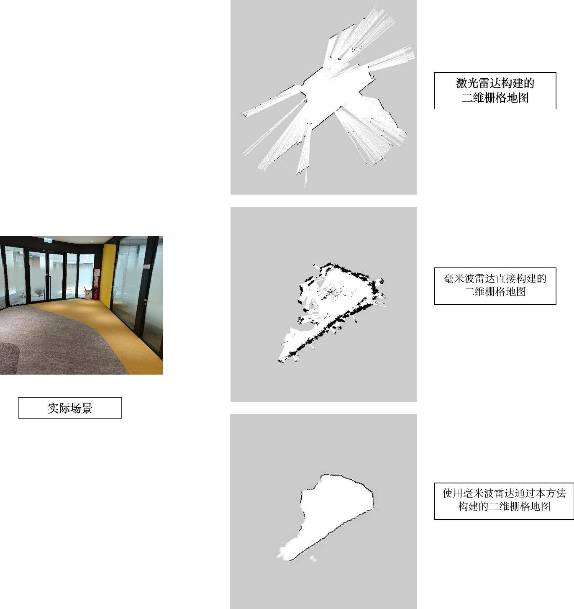

# PIX2PIX-MMwave-2dGridMap

A large amount of raw code is referred to [pix2pixHD](https://github.com/NVIDIA/pix2pixHD).

## Test Enviornment
- linux or MacOS, numpy: `1.24.0`, pytorch `1.11.0 + cu115`
- Docker container, base image: `nvcr.io/nvidia/pytorch:19.04-py3`

## Usage

### Dataset
Refer to the [rules](./maps/map/rules.txt) during data preparation

### Train
```bash
cd scripts && ./train.sh
```
### Test
```bash
cd scripts && ./plot.sh # Estimate model training loss
cd scripts && ./test.sh
```
### Demo
